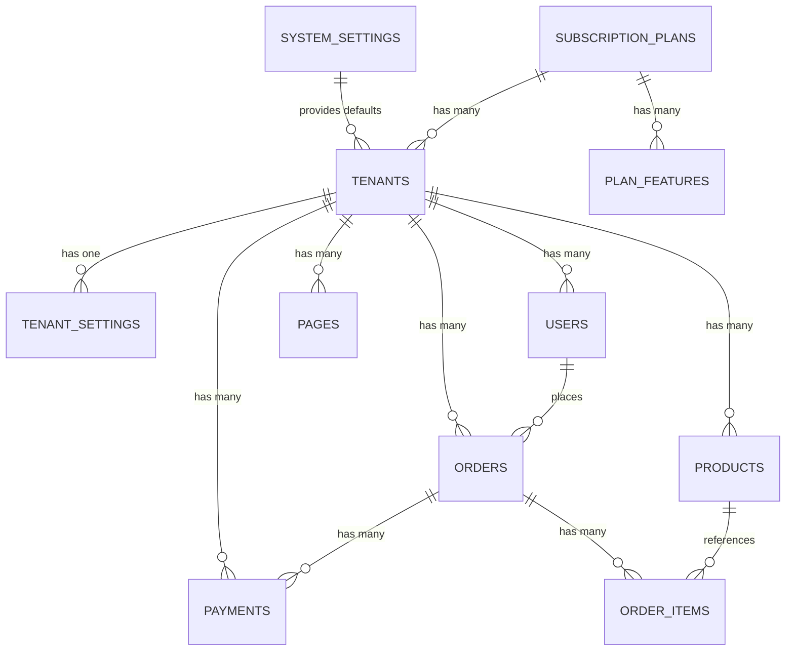

# Database Schema Documentation

## Overview

The Kedai SaaS platform uses a single-database multi-tenancy architecture with 11 custom tables plus 6 Spatie Permission tables.

---

## Table Relationships

---

## Tables

### 1. system_settings

**Purpose**: Store system-wide configuration that applies to all tenants by default.

| Column | Type | Nullable | Default | Description |
|--------|------|----------|---------|-------------|
| id | bigint unsigned | NO | AUTO_INCREMENT | Primary key |
| system_name | varchar(255) | NO | 'Kedai' | System name displayed across platform |
| site_description | text | YES | NULL | System description |
| logo_path | varchar(255) | YES | NULL | Path to system logo |
| favicon_path | varchar(255) | YES | NULL | Path to favicon |
| color_primary | varchar(255) | NO | '#1e3a8a' | Primary color (Navy Blue) |
| color_secondary | varchar(255) | NO | '#3b82f6' | Secondary color (Light Blue) |
| color_tertiary | varchar(255) | NO | '#60a5fa' | Tertiary color (Lighter Blue) |
| default_language | varchar(255) | NO | 'en' | Default language code |
| default_currency | varchar(255) | NO | 'RM' | Default currency |
| created_at | timestamp | YES | NULL | Record creation time |
| updated_at | timestamp | YES | NULL | Record update time |

**Indexes**: Primary key on `id`

---

### 2. tenants

**Purpose**: Store seller/company information for multi-tenancy.

| Column | Type | Nullable | Default | Description |
|--------|------|----------|---------|-------------|
| id | bigint unsigned | NO | AUTO_INCREMENT | Primary key |
| company_name | varchar(255) | NO | - | Company/business name |
| subdomain | varchar(255) | NO | - | Unique subdomain (e.g., 'testshop') |
| custom_domain | varchar(255) | YES | NULL | Custom domain (e.g., 'shop.com') |
| company_registration_id | varchar(255) | YES | NULL | Business registration number |
| company_address | text | YES | NULL | Business address |
| company_phone | varchar(255) | YES | NULL | Contact phone |
| company_industry | varchar(255) | YES | NULL | Industry/category |
| owner_name | varchar(255) | NO | - | Owner/contact person name |
| logo_path | varchar(255) | YES | NULL | Tenant logo path |
| subscription_plan_id | bigint unsigned | YES | NULL | Current subscription plan |
| subscription_started_at | timestamp | YES | NULL | Subscription start date |
| subscription_expires_at | timestamp | YES | NULL | Subscription expiry date |
| status | enum | NO | 'active' | Status: active, suspended, cancelled |
| created_at | timestamp | YES | NULL | Record creation time |
| updated_at | timestamp | YES | NULL | Record update time |
| deleted_at | timestamp | YES | NULL | Soft delete timestamp |

**Indexes**: 
- Primary key on `id`
- Unique on `subdomain`
- Unique on `custom_domain`
- Foreign key on `subscription_plan_id` → `subscription_plans(id)`

---

### 3. tenant_settings

**Purpose**: Store per-tenant customization settings.

| Column | Type | Nullable | Default | Description |
|--------|------|----------|---------|-------------|
| id | bigint unsigned | NO | AUTO_INCREMENT | Primary key |
| tenant_id | bigint unsigned | NO | - | Reference to tenant |
| color_primary | varchar(255) | YES | NULL | Custom primary color |
| color_secondary | varchar(255) | YES | NULL | Custom secondary color |
| color_tertiary | varchar(255) | YES | NULL | Custom tertiary color |
| logo_path | varchar(255) | YES | NULL | Custom logo |
| favicon_path | varchar(255) | YES | NULL | Custom favicon |
| payment_gateways | json | YES | NULL | Enabled payment gateways |
| email_settings | json | YES | NULL | Email configuration |
| notification_settings | json | YES | NULL | Notification preferences |
| created_at | timestamp | YES | NULL | Record creation time |
| updated_at | timestamp | YES | NULL | Record update time |

**Indexes**: 
- Primary key on `id`
- Foreign key on `tenant_id` → `tenants(id)` CASCADE DELETE

---

### 4. subscription_plans

**Purpose**: Define available subscription plans.

| Column | Type | Nullable | Default | Description |
|--------|------|----------|---------|-------------|
| id | bigint unsigned | NO | AUTO_INCREMENT | Primary key |
| name | varchar(255) | NO | - | Plan name (e.g., 'Free', 'Starter') |
| slug | varchar(255) | NO | - | URL-friendly identifier |
| description | text | YES | NULL | Plan description |
| price | decimal(10,2) | NO | - | Monthly price |
| currency | varchar(3) | NO | 'RM' | Currency code |
| billing_period | enum | NO | 'monthly' | monthly, yearly, lifetime |
| plan_type | enum | NO | 'website' | website, ecommerce |
| product_limit | int | NO | 0 | Max products allowed |
| custom_domain | boolean | NO | false | Custom domain support |
| remove_trademark | boolean | NO | false | Remove system branding |
| email_accounts | int | NO | 0 | Email accounts included |
| priority_support | boolean | NO | false | Priority support flag |
| sort_order | int | NO | 0 | Display order |
| is_active | boolean | NO | true | Plan availability |
| created_at | timestamp | YES | NULL | Record creation time |
| updated_at | timestamp | YES | NULL | Record update time |

**Indexes**: 
- Primary key on `id`
- Unique on `slug`

---

### 5. plan_features

**Purpose**: Flexible feature management for subscription plans.

| Column | Type | Nullable | Default | Description |
|--------|------|----------|---------|-------------|
| id | bigint unsigned | NO | AUTO_INCREMENT | Primary key |
| subscription_plan_id | bigint unsigned | NO | - | Reference to plan |
| feature_name | varchar(255) | NO | - | Feature identifier |
| feature_value | varchar(255) | YES | NULL | Feature value/limit |
| is_enabled | boolean | NO | true | Feature enabled flag |
| created_at | timestamp | YES | NULL | Record creation time |
| updated_at | timestamp | YES | NULL | Record update time |

**Indexes**: 
- Primary key on `id`
- Foreign key on `subscription_plan_id` → `subscription_plans(id)` CASCADE DELETE

---

### 6. products

**Purpose**: Store product catalog for e-commerce tenants.

| Column | Type | Nullable | Default | Description |
|--------|------|----------|---------|-------------|
| id | bigint unsigned | NO | AUTO_INCREMENT | Primary key |
| tenant_id | bigint unsigned | NO | - | Reference to tenant |
| name | varchar(255) | NO | - | Product name |
| slug | varchar(255) | NO | - | URL-friendly identifier |
| description | text | YES | NULL | Product description |
| price | decimal(10,2) | NO | - | Selling price |
| compare_at_price | decimal(10,2) | YES | NULL | Original/compare price |
| stock_quantity | int | NO | 0 | Available stock |
| sku | varchar(255) | YES | NULL | Stock keeping unit |
| images | json | YES | NULL | Product images array |
| is_active | boolean | NO | true | Product visibility |
| sort_order | int | NO | 0 | Display order |
| created_at | timestamp | YES | NULL | Record creation time |
| updated_at | timestamp | YES | NULL | Record update time |
| deleted_at | timestamp | YES | NULL | Soft delete timestamp |

**Indexes**: 
- Primary key on `id`
- Foreign key on `tenant_id` → `tenants(id)` CASCADE DELETE
- Composite index on `(tenant_id, slug)`

---

### 7. orders

**Purpose**: Store order headers with buyer and payment information.

| Column | Type | Nullable | Default | Description |
|--------|------|----------|---------|-------------|
| id | bigint unsigned | NO | AUTO_INCREMENT | Primary key |
| order_number | varchar(255) | NO | - | Unique order identifier |
| tenant_id | bigint unsigned | NO | - | Reference to tenant |
| user_id | bigint unsigned | YES | NULL | Reference to buyer (if registered) |
| buyer_name | varchar(255) | NO | - | Buyer full name |
| buyer_email | varchar(255) | NO | - | Buyer email |
| buyer_phone | varchar(255) | YES | NULL | Buyer phone |
| shipping_address | text | YES | NULL | Delivery address |
| billing_address | text | YES | NULL | Billing address |
| subtotal | decimal(10,2) | NO | - | Items subtotal |
| tax | decimal(10,2) | NO | 0 | Tax amount |
| shipping_fee | decimal(10,2) | NO | 0 | Shipping cost |
| total | decimal(10,2) | NO | - | Total amount |
| status | enum | NO | 'new' | new, processing, completed, cancelled |
| payment_status | enum | NO | 'pending' | pending, paid, failed, refunded |
| customer_notes | text | YES | NULL | Customer notes |
| admin_notes | text | YES | NULL | Internal notes |
| created_at | timestamp | YES | NULL | Order creation time |
| updated_at | timestamp | YES | NULL | Record update time |
| deleted_at | timestamp | YES | NULL | Soft delete timestamp |

**Indexes**: 
- Primary key on `id`
- Unique on `order_number`
- Foreign key on `tenant_id` → `tenants(id)` CASCADE DELETE
- Foreign key on `user_id` → `users(id)` SET NULL
- Composite index on `(tenant_id, order_number)`
- Composite index on `(tenant_id, status)`

---

### 8. order_items

**Purpose**: Store individual line items for each order.

| Column | Type | Nullable | Default | Description |
|--------|------|----------|---------|-------------|
| id | bigint unsigned | NO | AUTO_INCREMENT | Primary key |
| order_id | bigint unsigned | NO | - | Reference to order |
| product_id | bigint unsigned | YES | NULL | Reference to product |
| product_name | varchar(255) | NO | - | Product name snapshot |
| product_sku | varchar(255) | YES | NULL | SKU snapshot |
| price | decimal(10,2) | NO | - | Unit price at time of order |
| quantity | int | NO | - | Quantity ordered |
| subtotal | decimal(10,2) | NO | - | Line item total |
| created_at | timestamp | YES | NULL | Record creation time |
| updated_at | timestamp | YES | NULL | Record update time |

**Indexes**: 
- Primary key on `id`
- Foreign key on `order_id` → `orders(id)` CASCADE DELETE
- Foreign key on `product_id` → `products(id)` SET NULL

---

### 9. payments

**Purpose**: Track all payment transactions.

| Column | Type | Nullable | Default | Description |
|--------|------|----------|---------|-------------|
| id | bigint unsigned | NO | AUTO_INCREMENT | Primary key |
| order_id | bigint unsigned | YES | NULL | Reference to order |
| tenant_id | bigint unsigned | NO | - | Reference to tenant |
| transaction_id | varchar(255) | NO | - | Gateway transaction ID |
| payment_gateway | varchar(255) | NO | - | Gateway name (toyyibpay, billplz, etc.) |
| amount | decimal(10,2) | NO | - | Payment amount |
| currency | varchar(3) | NO | 'RM' | Currency code |
| status | enum | NO | 'pending' | pending, completed, failed, refunded |
| gateway_response | json | YES | NULL | Full gateway response |
| notes | text | YES | NULL | Additional notes |
| paid_at | timestamp | YES | NULL | Payment completion time |
| created_at | timestamp | YES | NULL | Record creation time |
| updated_at | timestamp | YES | NULL | Record update time |

**Indexes**: 
- Primary key on `id`
- Unique on `transaction_id`
- Foreign key on `order_id` → `orders(id)` SET NULL
- Foreign key on `tenant_id` → `tenants(id)` CASCADE DELETE
- Composite index on `(tenant_id, status)`

---

### 10. pages

**Purpose**: Store landing pages created by sellers.

| Column | Type | Nullable | Default | Description |
|--------|------|----------|---------|-------------|
| id | bigint unsigned | NO | AUTO_INCREMENT | Primary key |
| tenant_id | bigint unsigned | NO | - | Reference to tenant |
| title | varchar(255) | NO | - | Page title |
| slug | varchar(255) | NO | - | URL-friendly identifier |
| content | longtext | YES | NULL | JSON content from page builder |
| html_content | longtext | YES | NULL | Rendered HTML |
| is_published | boolean | NO | false | Publication status |
| is_homepage | boolean | NO | false | Homepage designation |
| created_at | timestamp | YES | NULL | Record creation time |
| updated_at | timestamp | YES | NULL | Record update time |

**Indexes**: 
- Primary key on `id`
- Foreign key on `tenant_id` → `tenants(id)` CASCADE DELETE
- Composite index on `(tenant_id, slug)`

---

### 11. users (Modified)

**Purpose**: Store all user types (Super Admin, Admin, Seller, Buyer).

**Added Columns**:
| Column | Type | Nullable | Default | Description |
|--------|------|----------|---------|-------------|
| tenant_id | bigint unsigned | YES | NULL | Reference to tenant (for sellers/buyers) |
| preferred_language | varchar(255) | NO | 'en' | User's language preference |
| phone | varchar(255) | YES | NULL | Contact phone number |

**Indexes**: 
- Foreign key on `tenant_id` → `tenants(id)` CASCADE DELETE

---

## Spatie Permission Tables

The following tables are created by the Spatie Laravel Permission package:

1. **roles** - User roles (superadmin, admin, seller, buyer)
2. **permissions** - System permissions
3. **model_has_roles** - Pivot table (users ↔ roles)
4. **model_has_permissions** - Pivot table (users ↔ permissions)
5. **role_has_permissions** - Pivot table (roles ↔ permissions)

---

## Data Integrity Rules

### Cascade Deletes
- Deleting a tenant cascades to: tenant_settings, products, orders, payments, pages, users
- Deleting a subscription plan cascades to: plan_features
- Deleting an order cascades to: order_items

### Set Null on Delete
- Deleting a user sets `user_id` to NULL in orders
- Deleting a product sets `product_id` to NULL in order_items
- Deleting an order sets `order_id` to NULL in payments

### Soft Deletes
- tenants
- products
- orders

---

## Seeded Data

### Roles (4)
- superadmin
- admin
- seller
- buyer

### Permissions (8)
- manage-system-settings
- manage-admins
- manage-sellers
- manage-subscription-plans
- view-analytics
- manage-products
- manage-orders
- manage-pages

### Subscription Plans (6)
1. Free (RM 0/month) - Website
2. Starter (RM 19/month) - Website
3. Professional (RM 79/month) - Website
4. Launch (RM 69/month) - E-commerce
5. Grow (RM 99/month) - E-commerce
6. Scale (RM 399/month) - E-commerce

### System Settings (1)
- System Name: Kedai
- Colors: Navy Blue (#1e3a8a), Light Blue (#3b82f6, #60a5fa)
- Default Language: English
- Default Currency: RM

### Users (1)
- Super Admin (superadmin@kedai.test)
